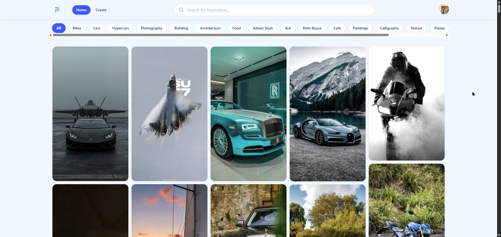
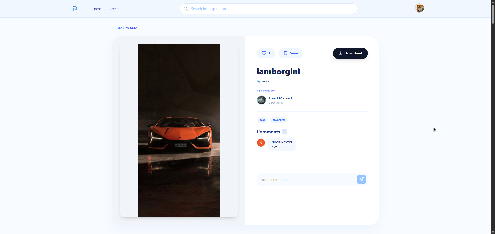
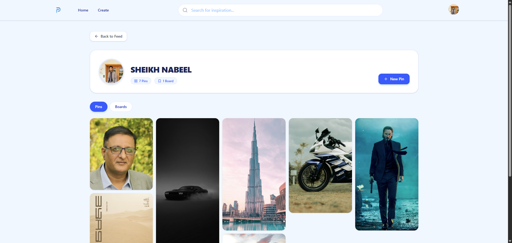
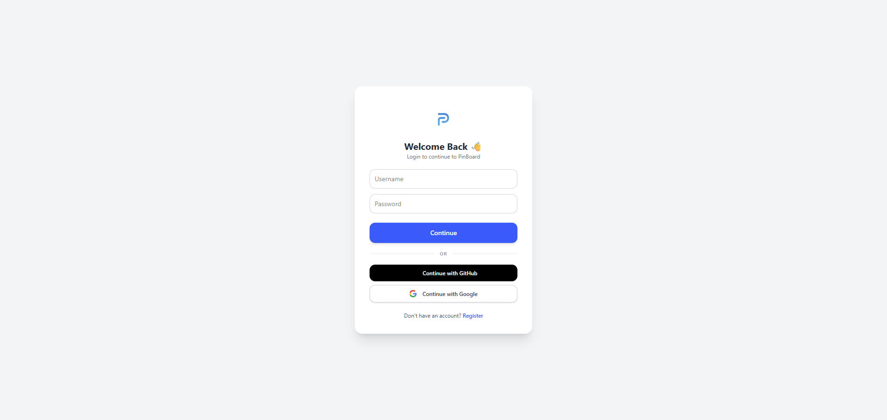
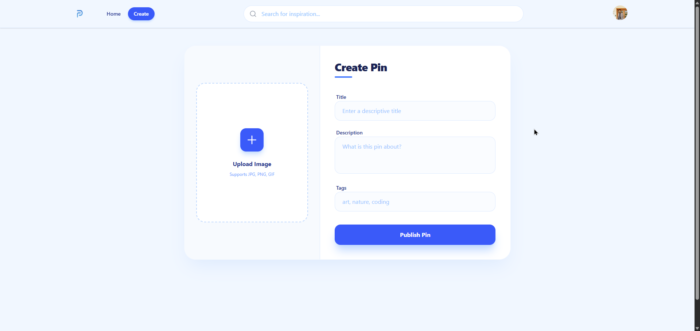
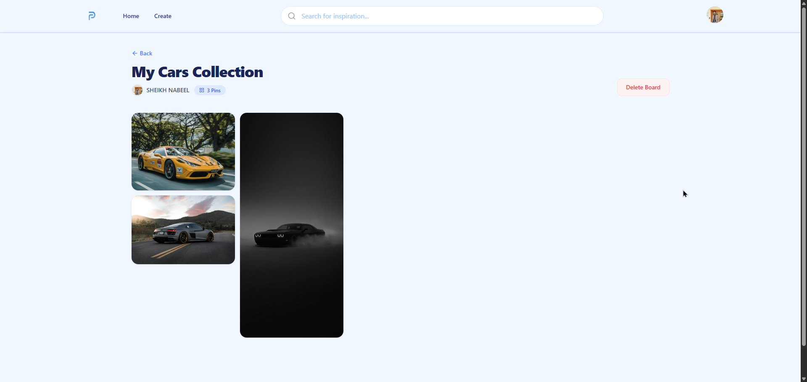

<div align="center">


# PinBoard — A Visual Content Sharing Platform

**A full-stack Pinterest-inspired app where you can upload, organize, and discover image content.**

[](https://pinboard-nextjs.vercel.app)
[](https://github.com/Nabeel-8090/pinboard-nextjs)


</div>

---

## 🎬 Demo

> 📹 **Add your screen recording or GIF here**
> *(Record a 30–45 sec walkthrough: login → browse pins → create pin → view board)*

```
[ Replace this with a GIF or YouTube video link ]
```

---

## 📸 Screenshots

| Home Feed | Pin Detail | Profile |
|-----------|------------|---------|
|  |  |  |

| Login Page | Create Pin | Boards |
|------------|------------|--------|
|  |  |  |

---

## ✨ Features

- **Upload & share** image pins with title, description, and category
- **Organize** pins into named boards
- **Like & comment** on other users' pins
- **Discover** content by category or keyword search
- **Multi-provider auth** — Google, GitHub, or username/password
- **Cloud image storage** via Cloudinary CDN
- **Fully responsive** UI across all screen sizes

---

## 🛠️ Tech Stack

| Layer | Technology |
|-------|-----------|
| **Framework** | Next.js 16.2.4 (App Router) |
| **Database** | PostgreSQL via Prisma ORM (Neon) |
| **Authentication** | NextAuth.js v4 |
| **Image Storage** | Cloudinary |
| **Styling** | Tailwind CSS v4 |
| **Deployment** | Vercel |

---

## 🗄️ Database Design

The app uses a **relational PostgreSQL database** with 6 entities:

```
User ──< Pin ──< Like
          │
          ├──< Comment
          │
          └──< BoardPin >── Board ──< User
```

| Entity | Description |
|--------|-------------|
| `User` | Registered users with OAuth or credentials |
| `Pin` | Image posts with title, description, category |
| `Board` | Named collections created by users |
| `BoardPin` | Junction table linking pins to boards |
| `Like` | User likes on pins |
| `Comment` | User comments on pins |

---

## 🔐 Authentication

Three login methods supported via **NextAuth.js v4**:

- **Google OAuth** — one-click sign in
- **GitHub OAuth** — one-click sign in
- **Credentials** — username + bcrypt-hashed password

Sessions are verified server-side using `getServerSession` on all protected API routes.

---

## 📡 API Overview

All backend logic lives in `app/api/` as **Next.js Route Handlers** following REST conventions:

```
POST   /api/pins          → Create a pin
GET    /api/pins          → Fetch all pins (with filters)
GET    /api/pins/[id]     → Get single pin
POST   /api/pins/[id]/like     → Like a pin
POST   /api/pins/[id]/comment  → Comment on a pin
POST   /api/boards        → Create a board
POST   /api/boards/[id]/pins  → Add pin to board
```

---

## 🚀 Getting Started

```bash
# 1. Clone the repo
git clone https://github.com/Nabeel-8090/pinboard-nextjs.git
cd pinboard-nextjs

# 2. Install dependencies
npm install

# 3. Set up environment variables
cp .env.example .env.local
# Fill in your keys (see below)

# 4. Push database schema
npx prisma db push

# 5. Run the dev server
npm run dev
```

### Environment Variables

```env
DATABASE_URL=
NEXTAUTH_SECRET=
NEXTAUTH_URL=

GOOGLE_CLIENT_ID=
GOOGLE_CLIENT_SECRET=

GITHUB_ID=
GITHUB_SECRET=

CLOUDINARY_CLOUD_NAME=
CLOUDINARY_API_KEY=
CLOUDINARY_API_SECRET=
```

---

## 👨‍💻 Team

Built with ❤️ as a DBMS course project.

| Name | GitHub |
|------|--------|
| Nabeel | [@Nabeel-8090](https://github.com/Nabeel-8090) |
| Haad Majeed | [@Haad27](https://github.com/Haad27) |
| Aqib Faisal | [@aqibfaisal006](https://github.com/aqibfaisal006) |
| Aqib Ali | [@AqibElia](https://github.com/AqibElia) |

---

## 📄 License

This project is for academic purposes.

---

<div align="center">

⭐ **If you liked this project, give it a star!** ⭐

</div>
